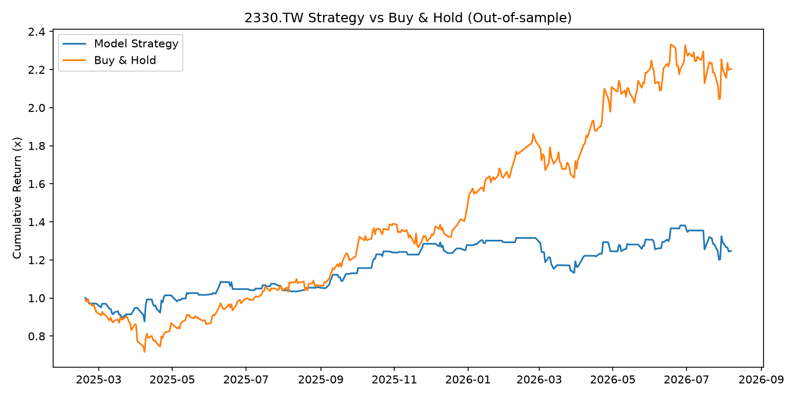

# 📈 台積電明日漲跌方向預測：一次 Walk-Forward 驗證的實證研究


> **研究核心摘要**：本專案採用 2018–2026 年日頻價量資料，透過 12 個技術指標與 LightGBM 模型預測台積電（2330.TW）隔日漲跌方向。經過嚴謹的 6-fold Walk-Forward 擴張視窗驗證，Out-of-Sample 準確率為 **49.7%**（接近隨機猜測），實證單靠公開日頻技術指標無法穩定獲取超額報酬，符合效率市場假說（EMH）。

---

## 🎯 動機與假設

嘗試使用公開的價量技術指標預測台積電（2330.TW）明日股價的漲跌方向，並運用嚴謹的時間序列驗證方法（Walk-Forward Validation）檢驗這類策略是否具有實際可用的預測能力與交易價值。

---

## 🔬 資料與方法

- **資料來源**：Yahoo Finance，2018-01-01 至今的日頻價量資料（共 2,087 筆）
- **特徵工程**：12 個技術指標，涵蓋動量（不同天期報酬率）、波動率、均線乖離率、成交量變化、RSI、當日振幅
- **模型架構**：LightGBM 二元分類器，預測明日收盤價是否高於今日
- **驗證方法**：Walk-Forward（擴張視窗）交叉驗證（共 6 個 Fold），每次僅用「過去」資料訓練、預測「未來」資料，嚴格避免 Look-ahead Bias
- **回測設定**：將預測訊號轉換為模擬交易，扣除 5 bps 單邊交易成本，並與 Buy & Hold 策略對照

---

## 📊 驗證與回測結果



| 評估指標 | 實測數值 | 說明 |
| :--- | :---: | :--- |
| **Out-of-sample 整體準確率** | **49.7%** | 各 Fold 在 43% ~ 58% 之間震盪 |
| **Precision** | **48.1%** | 正確預測上漲的比例 |
| **Recall** | **43.4%** | 捕捉到上漲日期的比例 |
| **策略累積報酬** | **24.68%** | 扣除 5 bps 交易成本後 |
| **Buy & Hold 累積報酬** | **120.27%** | 同期大盤/個股基準 |
| **策略年化報酬** | **16.70%** | 年化複合收益率 |
| **策略 Sharpe Ratio** | **0.75** | 風險調整後收益 |
| **策略最大回撤 (MDD)** | **-14.00%** | 策略最高點至最低點拉回幅度 |

> [!NOTE]
> 各 Fold 準確率在 43%\~58% 之間震盪，未呈現穩定趨勢。特徵重要性分佈相對平均（數值介於 122\~191），無任何單一特徵明顯主導模型判斷。

---

## 💡 發現與解讀

1. **市場效率性驗證**  
   模型 Out-of-Sample 準確率接近 50%，幾乎等同隨機猜測。顯示**單靠公開的日頻技術指標，難以穩定預測台積電這類高流動性、被大量法人研究的高效率個股單日漲跌方向**，結果符合效率市場假說（EMH）。
2. **回測績效差異主因**  
   策略報酬（24.68%）遠低於 Buy & Hold（120.27%），主因是 2025 年下半年台積電進入強力上漲趨勢，而模型頻繁判斷「不漲」導致策略在多個上漲區間空手。策略的低波動與較小回撤（-14%），主要是「保守空手」換來的，而非找到有效的擇時訊號。

---

## ⚖️ 專案的價值與限制

本專案的價值在於**用嚴謹的方法論（Walk-Forward 驗證、避免資料洩漏、扣除真實交易成本）誠實地檢驗假設**。驗證了「用簡單技術指標預測單日方向」在高效率個股上極難成立，而非說明資料科學方法無效。

---

## 🚀 下一步探索方向

- [ ] **改變預測目標**：從單日方向改為預測未來 5 日或 20 日的報酬方向，降低雜訊並提高訊噪比（SNR）。
- [ ] **預測目標轉換**：改為預測「波動率」而非漲跌方向（量化實務上更容易被驗證）。
- [ ] **加入信心門檻**：僅在模型預測機率顯著偏離 50% 時才進場，犧牲交易次數以提升 Precision。
- [ ] **多元資料源**：納入新聞情緒分析、財報數據、晶片供應鏈數據與大盤連動性。

---

## ⚙️ 環境安裝與執行

```bash
# 1. 安裝套件
pip install -r requirements.txt

# 2. 執行預測與回測
python tsmc_predict.py

📂 專案結構
tsmc_predictor/
├── .gitignore
├── README.md
├── requirements.txt
├── tsmc_predict.py
└── outputs/
    └── equity_curve.png